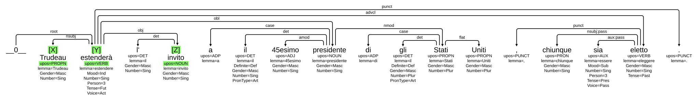
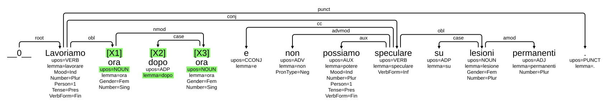
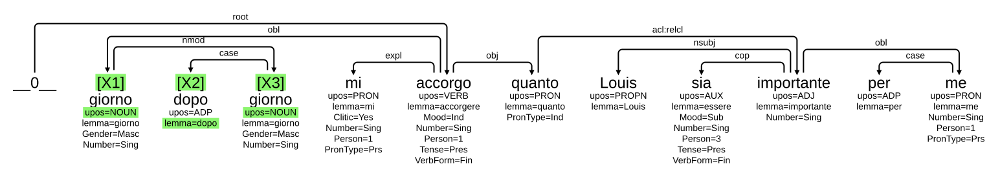
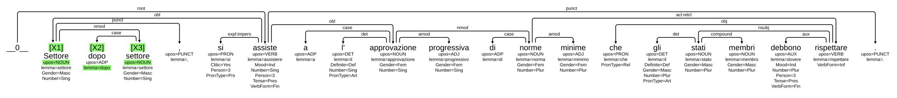
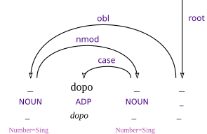
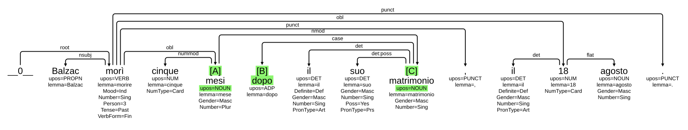

# Formalizing a Construction for ItCon: A Practical Guide

ItCon aims to be a Machine-Readable Constructicon.

It is composed of several elements that interact with each other to allow consulting and updating
the constructicon according to multiple use cases.

In particular:

- a database of constructions
- a graph that organizes the constructions into a network
- a corpus of incrementally annotated examples
- an interface for querying and visualization

To make this possible, it is necessary to precisely define the construction object,
which represents the core of the resource.

## Construction Identikit

Each construction in ItCon is defined by a main file, in `.yaml` format.

### What is YAML?

**YAML** (recursive acronym for *YAML Ain’t Markup Language*) is a **textual format**, easily
readable by both humans and machines, used to represent structured data and widely
used for data exchange.

#### Key features

- **Simplicity and readability**: the syntax is minimal and intuitive.
- **Indentation-based**: the data structure is determined by spaces, not by brackets or tags.
- **Support for common data types**: strings, numbers, booleans, lists, dictionaries (maps/objects).
- **Compatibility**: often used as a more readable alternative to JSON and XML.

#### Example

```yaml
person:
  name: John Doe
  age: 30
  address:
    street: 123 Main St
    city: Example City
```

#### Fundamental YAML rules

1. **Indentation with spaces**: The structure is defined by spaces at the beginning of lines (typically 2).
   ```yaml
   person:
    name: Anna
    age: 28
   ```
2. **Comments**: the `#` character is interpreted as a comment, and any text after it
   is ignored.
   ```yaml
   person:     # add new person
     name: Anna
     age: 28
   ```
3. **Key–value pairs**: Keys must be unique at the same level.
   In the previous example, `name` and `age` are keys, while `Anna` and `28` are values.
   Each `person` can have only one `name` and one `age`.
4. **Data types**:
   We can represent strings (also multiline), numbers, boolean values (true/false),
   null values (`null`).
5. **Lists**: Each list element starts with `-` followed by a space.
  ```yaml
  person:
    name: Anna
    age: 28
    languages:
      - Italian
      - English
      - French
   ```
6. **Multiline strings**:
  ```yaml
  person:
    name: Anna
    age: 28
    biography: |
      This biography of Anna will preserve line breaks.
      We can write text on multiple lines.
    short-bio: >
      This biography of Anna is
      instead wrapped only to improve
      readability in yaml.
  ```

### The content of a construction in `.yaml` format

```yaml

id: 68                                  # integer (for now chosen arbitrarily)
                                        # that uniquely identifies the construction

name: salta fuori che V                 # "human-readable" name of the construction
                                        # (to remind us what we're talking about)

cxn-machine-readable: cxn_68.conllc     # reference to a file we'll talk about shortly

definition: |                           # string describing the construction
    A new piece of information comes to the speaker's knowledge from an external source.
    The information acquired is often unexpected or contradicts the speaker's expectations on the state of affairs, thus generating surprise in the speaker.
    However, since the moment of acquisition and the moment of enunciation are distinct, this construction does not convey that the speaker is currently surprised, but it is used to convey or generate surprise in the audience.

restrictions: |                         # description of the restrictions that apply to the construction
    The main verb saltare fuori is always impersonal, so it has no subject and it is always found in the 3rd person singular.
    The verb in the complement clause is always in a finite form.

coll-preferences:                       # description of collocational preferences

usage:                                  # description of collocational preferences

form-tags:                              # tags describing the construction from a formal point of view
                                        # (constructions and strategies in MoCCa)
    - cc:cxn:complement-clause-construction
    - impersonal construction


function-tags:                          # tags describing the construction from a functional point of view
                                        # (meanings and information packaging in MoCCa)
    - cc:sem:evidentiality
    - cc:sem:mirative


complexity-level:                       # complexity level of the construction
    - clause

category-tags:                          # output category of the construction
    - not applicable

schematicity: partially filled/schematic # level of schematicity

cefr-level:                             # CEFR

horizontal-links:                       # horizontal and vertical links
    - 167
vertical-links:

examples:                               # IDs of sentences in which the construction occurs (wait for it)
    - 1_Paisà_FP06072024
    - 2_Paisà_FP06072024
    - 3_Paisà_FP06072024
    - 4_Paisà_FP06072024
    - 5_Paisà_FP06072024

references:                             # possible bibliographic reference
    - Pisciotta2023confini

collector: Flavio                       # your username

note: |                                 # further info
    This construction can have both an evidential and a mirative reading, depending on the surrounding context.
    It is often found in adversative (example1, example5), temporal, or more generally, coordinate clauses (example3), which favour a mirative 'counterexpectation' reading (i.e., the event or state in the complement clause is in contrast with the speaker's expectations).
    More rarely, the external source of information is specified in the context, triggering an evidential interpretation (i.e., the speaker gets to know something from a source).
```

#### How to fill in this file?

No panic! It’s not important that all fields are completed right away.

You can start from the [xxx]() file and try to complete it as best as you can.
What matters is that the `.yaml` file is well-formed in the end.

For more information on how to fill in individual fields: [tentative wiki](https://github.com/LaboratorioSperimentale/adoc/wiki/3.-Constructicon-entries:-definition-of-the-fields)

## `conll-c`, `conllu-c` and interoperability with UD

Let’s now look specifically at the `cxn-machine-readable:` and `examples` fields of the `yaml` file.

Although formal properties (i.e., morphosyntactic ones) are only part of the elements needed
to represent a construction, the vast majority of the corpora at our disposal are based
on such annotations.

This implies two things:

- we have a lot of tools that allow us to manipulate formal and structural properties
  annotated on resources
- if we hope to leverage the automatic population of ItCon in the future, we need to understand how
  to make the most of the annotation we already have available

In the case of ItCon, we chose the formalism offered by [**Universal Dependencies**]() for a
number of reasons:

- 'light' syntactic formalism
- cross-linguistic compatibility
- wide availability of tools
- interoperability with [**grew match**]()
- accuracy of automatic annotation

We therefore developed two formats (`CoNLL-C` and `CoNLL-Uc`) to represent the constructicon
in a way that is interoperable with UD resources and at the same time model the development of the resource
independently and in a machine-readable way.

### The [CoNLL-U](https://universaldependencies.org/format.html) format

UD corpora are annotated in a tabular format.

A treebank consists of a sequence of sentences: [example](https://github.com/UniversalDependencies/UD_Italian-MarkIT/blob/master/it_markit-ud-test.conllu)

Each sentence contains:

- lines relating to words, consisting of 10 tab-separated fields. Each field expresses an annotation
  or a property relating to the word
- comments and metadata (identified by `#`)

Each sentence represents a tree:


## The CoNLL-C format

In ItCon each construction is associated with a file in `.conllc` format.

CoNLL-C builds on the CoNLL-U guidelines and extends them to represent the constraints required
by our representation.

To start with, we can think of a construction as defined by a [catena](osborne-catenae.pdf)
on a dependency tree, i.e., a set of nodes bound together by syntactic relations.







We want to represent our construction as an object of this kind:



### The fields in CoNLL-C

#### The CoNLL-U base

As in CoNLL-U, in our format we also distinguish two types of lines:

- lines that represent minimal elements of the construction (typically, words), whose properties
  are expressed in tab-delimited fields
- lines introduced by `#`, which represent properties of the construction as a whole.

Let’s focus on the element-lines and their fields.
The previous construction, viewed in tabular format, looks like this:

ID | FORM | LEMMA | UPOS | XPOS | FEATS | HEAD | DEPREL | DEPS | MISC
------- | ------- | ------- | ------- | ------- | ------- | ------- | ------- | ------- | -------
1 | _ | _ | NOUN | S | Number=Sing | 4 | obl | _ | _
2 | dopo | dopo | ADP | E | _ | 3 | case | _ | _
3 | _ | _ | NOUN | S | Number=Sing | 1 | nmod | _ | _
4 | _ | _ | _ | V | _ | 0 | root | _ | _

In CoNLL-C we focus only on the internal elements of the construction, which will therefore have 3 elements
(instead of 4).
The basic idea is to use the fields to express the constraints that the construction must satisfy

- the **ID** field consists of letters rather than numbers. This is because in CoNLL-U numbers
  also indicate that the elements must appear in that order and be adjacent. In our case, we want
  the structure to allow not fixing the order or
  inserting other material between one element and another of the construction. The ID field is the only
  mandatory field in the format; for all the others it is possible to insert the value `_` to indicate that
  no constraint is imposed on the field
- the **form** field should be filled in when the form is fixed. For example, in the construction
  above (N dopo N), **dopo** is a token fixed at the form level.
  The form field can be expressed using a regular expression (by prefixing the string with `r`).
- the **lemma** field expresses constraints at the lemma level. For example, in the construction
  *salta fuori che X*, the first element (*salta*) can vary within the paradigm of the lemma *saltare*, which
  is the constraint we want to fix
- the **upos** field expresses constraints at the part-of-speech level and contains values
  from the [Universal Dependencies inventory](https://universaldependencies.org/u/pos/index.html)
- the **feats** field contains annotations on [morphological features](https://universaldependencies.org/u/feat/index.html)
  (e.g., constraints on gender, number, tense and mood of verbs…)
- the **head** field contains one of the identifiers in the ID field, or `0` for the *head* of the construction
- the **deprel** field contains values from the [Universal Dependencies inventory](https://universaldependencies.org/u/dep/index.html),
  and `root` for the head of the construction

So far we have essentially expressed the same format as above, with minimal changes:

ID | FORM | LEMMA | UPOS | FEATS | HEAD | DEPREL
------- | ------- | ------- | ------- | ------- | ------- | -------
A | _ | _ | NOUN | Number=Sing | 0 | root
B | dopo | dopo | ADP | _ | C | case
C | _ | _ | NOUN | Number=Sing | A | nmod

#### Further restrictions

Let’s now introduce additional constraints that take our format further away from CoNLL-U.

- A first difference concerns the possible presence of an external constraint on the dependency.
  In our case, the construction **N dopo N** that we want to formalize appears as a modifier
  in the wider context of the sentence. In fact, in the examples above, *ora*, *giorno*, and *settore*
  are linked by the relation **obl** to another element of the sentence.
  We can express this external constraint by specifying the relation **root** and indicating
  **root:obl** in the `DEPREL` field of element A.
- As formalized so far, our construction expresses more patterns than we want.
  The construction **N dopo N**, in fact, requires the two **N**s to be identical. We can express this
  constraint in the **IDENTITY** field, which has the following syntax: `field_name:ID`.

  ID | FORM | LEMMA | UPOS | FEATS | HEAD | DEPREL | IDENTITY
  ------- | ------- | ------- | ------- | ------- | ------- | ------- | ------
  A | _ | _ | NOUN | Number=Sing | 0 | root | FORM=C
  B | dopo | dopo | ADP | _ | C | case | _
  C | _ | _ | NOUN | Number=Sing | A | nmod | FORM=A

  In the same way, agreement constraints can also be expressed (e.g., Subject and Verb must
  agree in number).
- In the case of the **N dopo N** construction, we need to consider other aspects (in this case, partially
  overlapping)
  
  On the one hand, the construction requires the three elements to be all adjacent, with no material
  either between **N** and **dopo**, or between **dopo** and **N**.
  We can express this in the **ADJACENCY** field: if the adjacency field of element X contains
  the ID Y, it means that X must immediately precede Y in the sentence.
  Another aspect often related to the presence of other material is the possibility that the elements
  of the construction exhibit further modification.

  ID | FORM | LEMMA | UPOS | FEATS | HEAD | DEPREL | IDENTITY | ADJACENCY
  ------- | ------- | ------- | ------- | ------- | ------- | ------- | ------ | ------
  A | _ | _ | NOUN | Number=Sing | 0 | root | FORM=C | _
  B | dopo | dopo | ADP | _ | C | case | _ | A
  C | _ | _ | NOUN | Number=Sing | A | nmod | FORM=A | B

  Likewise, we can impose constraints on the kinds of other dependencies an element has.
  For example, in this case we want to filter cases like *casa sua dopo casa mia* that are not
  instances of the **N dopo N** we are looking for.
  This type of constraint should be reported in the **EXCLUSION** field, whose syntax is:
  `KEYWORD:FIELD=VALUE`.
  Currently the only implemented keyword is `CHILDREN`, to indicate the types of relations we
  want to exclude. In our case, we want both nouns in the construction not to have,
  for example, adjectives modifying them: we can express this with the constraint `CHILDREN:DEPREL=amod`.

  ID | FORM | LEMMA | UPOS | FEATS | HEAD | DEPREL | IDENTITY | ADJACENCY | EXCLUSION
  ------- | ------- | ------- | ------- | ------- | ------- | ------- | ------ | ------ | ------
  A | _ | _ | NOUN | Number=Sing | 0 | root | FORM=C | _ | CHILDREN:DEPREL=amod
  B | dopo | dopo | ADP | _ | C | case | _ | A | _
  C | _ | _ | NOUN | Number=Sing | A | nmod | FORM=A | B | CHILDREN:DEPREL=amod

#### Semantic restrictions

Often important restrictions on the productivity of the construction come from the semantic field
linked to a slot.
Although UD does not provide for this type of annotation, in CoNLL-C two fields (**SEM_FEATS** and **SEM_ROLES**)
are dedicated to specifying such restrictions.

- For semantic features (**SEM_FEATS**), it is possible to specify the ontological class for nouns and
  verbs (`OntoClass`), the **Aktionsart** for verbs (`Aktionsart`), and the class from dedicated ontologies for
  adjectives and adverbs (`AdjClass` and `AdvClass`).
  If, for example, we want to formalize a subconstruction of the previous construction,
  restricting productivity to time nouns (*ora dopo ora*, *giorno dopo giorno*, but excluding
  *settore dopo settore*), we can express it as follows

  ID | FORM | LEMMA | UPOS | FEATS | HEAD | DEPREL | IDENTITY | ADJACENCY | EXCLUSION | SEM_FEATS
  ------- | ------- | ------- | ------- | ------- | ------- | ------- | ------ | ------ | ------ | ------
  A | _ | _ | NOUN | Number=Sing | 0 | root | FORM=C | _ | CHILDREN:DEPREL=amod | time
  B | dopo | dopo | ADP | _ | C | case | _ | A | _ | _
  C | _ | _ | NOUN | Number=Sing | A | nmod | FORM=A | B | CHILDREN:DEPREL=amod | time

- Similarly, we can annotate the semantic role realized by the elements of the construction,
  following the taxonomy provided by the [Unified Verb Index](https://uvi.colorado.edu/references_page#ThematicRoleHierarchy).

#### Notes on field syntax

If we think in terms of constraints, to best express the possible restrictions on
slots, we need to introduce some operations on possible values:

- **disjunction**: if we think of the construction *che X!*, we cannot express the part of speech
  to be assigned to X with a single label. We want to represent different constructions, which
  include both adjectives (*Che bello!*) and nouns (*Che noia!*).
  To express the disjunction between two values (“ADJ” or “NOUN”) we can generally use
  a comma.

  ID | FORM | LEMMA | UPOS | FEATS | HEAD | DEPREL | IDENTITY | ADJACENCY | EXCLUSION
  ------- | ------- | ------- | ------- | ------- | ------- | ------- | ------ | ------ | ------
  A | che | che | DET | _ | B | det | _ | _ | _
  B | _ | _ | ADJ,NOUN | _ | 0 | root | _ | _ | _

  Disjunction can occur:
  - in the **LEMMA** field (e.g., `che,qual`)
  - for each morphosyntactic feature (e.g., `VerbForm=Fin,Part`)
  - for the dependency relation *except root* (e.g., `det,amod`)
  - for semantic roles and semantic features

- **negation**: similarly, we may want to restrict productivity by excluding a value
  rather than listing possible values (for example: the slot can be filled by any
  category **except** a proper noun). In this case we use the exclamation mark to indicate it
  (`!PROPN`).

  Negation can occur:
  - in the **LEMMA** field (e.g., `!che`)
  - for each morphosyntactic feature (e.g., `VerbForm=!Fin`)
  - for the dependency relation *except root* (e.g., `!det`)
  - for semantic roles and semantic features

- **conjunction**: in the case of features and filters we wish to apply (**EXCLUSION**),
  we may want to express more than one constraint. For example, a certain element must be a noun of
  feminine gender and singular number.
  In continuity with the CoNLL-U format, this is expressed by the pipe symbol (`|`, for example
  `Gender=Fem|Number=Sing`).

Another aspect to consider is **optionality**. In the construction above (*che bello!*), we may
want to include the exclamation mark as optional. For this, the **REQUIRED** field can contain
values `0` or `1`.

## Morphology

The constructions we want to represent obviously do not necessarily operate at the level of the
sentence. They may also affect lower levels, such as the morphological level,
or higher levels, such as the textual level.

The CoNLL-C format can be used for constructions at the morphological level.
In this case we must represent the elements at the morphological level (below the word level)
that constitute the construction.

Let’s consider the case of the construction **X-issimo**, which creates superlatives of
adjectives.
We can model the construction as follows:

ID | FORM | LEMMA | UPOS | FEATS | HEAD | DEPREL | IDENTITY | ADJACENCY | EXCLUSION
------- | ------- | ------- | ------- | ------- | ------- | ------- | ------ | ------ | ------
A | r".*issim[oaie]" | _ | ADJ | Degree=Sup | 0 | root | _ | _ | _
A-1 | _ | _ | ADJ | _ | A | root/m | _ | _ | _
A-2 | _ | -issmo | BMORPH | _ | A-1 | der/m | _ | _ | _

Morphological elements are characterized by:

- **ID** composed of two components: a letter identifying the word they refer to and a progressive
  number
- As part of speech, elements that exist as free lexemes retain their part of speech, while bound forms
  (affixes, affixoids, combining forms) are annotated as **BMORPH**
- For dependencies, at the morpheme level we introduce the following relations:
  - **root/m**: the root within the morphological construction. In derivation it corresponds to the stem, in compounding it corresponds to the head of the compound.
  - **der/m**: the relation that links the derivational affix to the stem
  - **case/m**: the relation that links the complement to the head in subordinating compounds (e.g., *capostazione*)
  - **mod/m**: the relation that links the attribute to the head in attributive compounds (e.g., *altopiano*)
  - **conj/m**: the relation that links the second constituent to the first in coordinating compounds (e.g., *cartongesso*)

## Formal variation in CoNLL-C

It may happen that the constraints illustrated so far are not enough to satisfactorily represent the
construction in a way compatible with Universal Dependencies, often due to orthographic
variations or idiosyncrasies of the format.

For example, the construction **semiX** or **similX** can be instantiated either as a univerb,
with the presence of a hyphen **-**, or via modification.

In such cases, the `conllc` file can contain more than one structure.

## Examples in CoNLL-Uc

Once the formalization is complete, we can use it to annotate instances of the
construction in the corpora at our disposal, in particular by aligning our elements with
UD annotation.

As we have seen, the CoNLL-U format consists of 10 columns. To these we add an additional
column with our annotation.

Consider the following CoNLL-U example:
```
# sent_id = 3214_it_postwita
# source = http://hdl.handle.net/11234/1-5502 UD_Italian-PoSTWITA/it_postwita-ud-train 3214
# text = Pensa se alla fine di tutto sto casino viene fuori che Borghezio è l'unico onesto
```

ID | FORM | LEMMA | UPOS | XPOS | FEATS | HEAD | DEPREL | DEPS | MISC
------- | ------- | ------- | ------- | ------- | ------- | ------- | ------- | ------- | -------
1 | Pensa | pensare | VERB | V | Mood=Imp\|Number=Sing\|Person=2\|Tense=Pres\|VerbForm=Fin | 0 | root | _ | _
2 | se | se | SCONJ | CS | _ | 10 | mark | _ | _
3-4 | alla | _ | _ | _ | _ | _ | _ | _ | _
3 | a | a | ADP | E | _ | 5 | case | _ | _
4 | la | il | DET | RD | Definite=Def\|Gender=Fem\|Number=Sing\|PronType=Art | 5 | det | _ | _
5 | fine | fine | NOUN | S | Gender=Fem\|Number=Sing | 10 | obl | _ | _
6 | di | di | ADP | E | _ | 9 | case | _ | _
7 | tutto | tutto | DET | DI | PronType=Ind | 9 | det:predet | _ | _
8 | sto | questo | DET | DD | PronType=Dem | 9 | det | _ | _
9 | casino | casino | NOUN | S | Gender=Masc\|Number=Sing | 5 | nmod | _ | _
10 | viene | venire | VERB | V | Mood=Ind\|Number=Sing\|Person=3\|Tense=Pres\|VerbForm=Fin | 1 | ccomp | _ | CXN=167:A
11 | fuori | fuori | ADV | B | _ | 10 | advmod | _ | CXN=167:B
12 | che | che | SCONJ | CS | _ | 17 | mark | _ | CXN=167:C
13 | Borghezio | Borghezio | PROPN | SP | _ | 17 | nsubj | _ | _
14 | è | essere | AUX | V | Mood=Ind\|Number=Sing\|Person=3\|Tense=Pres\|VerbForm=Fin | 17 | cop | _ | _
15 | l' | il | DET | RD | Definite=Def\|Number=Sing\|PronType=Art | 17 | det | _ | SpaceAfter=No
16 | unico | unico | ADJ | A | Gender=Masc\|Number=Sing | 17 | amod | _ | _
17 | onesto | onesto | ADJ | A | Gender=Masc\|Number=Sing | 10 | ccomp | _ | _

Given a CoNLL-C formalization for the construction *viene fuori che X* as follows:

ID | FORM | LEMMA | UPOS | FEATS | HEAD | DEPREL | REQUIRED | EXCLUSION | SEM_FEATS | SEM_ROLES | ADJACENCY | IDENTITY
------- | ------- | ------- | ------- | ------- | ------- | ------- | ------- | ------- | ------- | -------- | -------- | --------
A | _ | venire | VERB | Number=Sing\|Person=3 | 0 | root | 1 | CHILDREN:DEPREL=nsubj | _ | _ | _ | _
B | fuori | fuori | ADV | _ | A | advmod | 1 | _ | _ | _ | _ | _
C | che | che | SCONJ | _ | D | mark | 1 | _ | _ | _ | _ | _
D | _ | _ | VERB,NOUN,ADJ | VerbForm=Fin | A | csubj,ccomp | 1 | _ | _ | Eventuality | _ | _

We can proceed to annotate the sentence by adding the necessary elements:

ID | FORM | LEMMA | UPOS | XPOS | FEATS | HEAD | DEPREL | DEPS | MISC | CONSTRUCTION
------- | ------- | ------- | ------- | ------- | ------- | ------- | ------- | ------- | ------- | -------
1 | Pensa | pensare | VERB | V | Mood=Imp\|Number=Sing\|Person=2\|Tense=Pres\|VerbForm=Fin | 0 | root | _ | _ | _
2 | se | se | SCONJ | CS | _ | 10 | mark | _ | _ | _
3-4 | alla | _ | _ | _ | _ | _ | _ | _ | _ | _
3 | a | a | ADP | E | _ | 5 | case | _ | _ | _
4 | la | il | DET | RD | Definite=Def\|Gender=Fem\|Number=Sing\|PronType=Art | 5 | det | _ | _ | _
5 | fine | fine | NOUN | S | Gender=Fem\|Number=Sing | 10 | obl | _ | _ | _
6 | di | di | ADP | E | _ | 9 | case | _ | _ | _
7 | tutto | tutto | DET | DI | PronType=Ind | 9 | det:predet | _ | _ | _
8 | sto | questo | DET | DD | PronType=Dem | 9 | det | _ | _ | _
9 | casino | casino | NOUN | S | Gender=Masc\|Number=Sing | 5 | nmod | _ | _ | _
10 | viene | venire | VERB | V | Mood=Ind\|Number=Sing\|Person=3\|Tense=Pres\|VerbForm=Fin | 1 | ccomp | _ | _ | 167:A
11 | fuori | fuori | ADV | B | _ | 10 | advmod | _ | _ | 167:B
12 | che | che | SCONJ | CS | _ | 17 | mark | _ | _ | 167:C
13 | Borghezio | Borghezio | PROPN | SP | _ | 17 | nsubj | _ | _ | _
14 | è | essere | AUX | V | Mood=Ind\|Number=Sing\|Person=3\|Tense=Pres\|VerbForm=Fin | 17 | cop | _ | _ | _
15 | l' | il | DET | RD | Definite=Def\|Number=Sing\|PronType=Art | 17 | det | _ | SpaceAfter=No | _
16 | unico | unico | ADJ | A | Gender=Masc\|Number=Sing | 17 | amod | _ | _ | _
17 | onesto | onesto | ADJ | A | Gender=Masc\|Number=Sing | 10 | ccomp | _ |  | 167:D

The same sentence—and even the same element—can bear annotations for multiple constructions.
When this happens, they are linked with pipes (`|`).

In the case of morphological constructions, elements below the word level must be added
to the example.

```
# sent_id = VIT-8523
# source = http://hdl.handle.net/11234/1-5502 UD_Italian-VIT/it_vit-ud-train VIT-8523
# text = Pochi, i cittadini di buona volontà, e seminascosti da un ingente presidio di poliziotti e di militari.
```

ID | FORM | LEMMA | UPOS | XPOS | FEATS | HEAD | DEPREL | DEPS | MISC | CONSTRUCTION
------- | ------- | ------- | ------- | ------- | ------- | ------- | ------- | ------- | ------- | -------
1 | Pochi | poco | PRON | PI | Gender=Masc\|Number=Plur\|PronType=Ind | 0 | root | _ | SpaceAfter=No | _
2 | , | , | PUNCT | FF | _ | 1 | punct | _ | _ | _
3 | i | il | DET | RD | Definite=Def\|Gender=Masc\|Number=Plur\|PronType=Art | 4 | det | _ | _ | _
4 | cittadini | cittadino | NOUN | S | Gender=Masc\|Number=Plur | 1 | appos | _ | _ | _
5 | di | di | ADP | E | _ | 7 | case | _ | _ | _
6 | buona | buono | ADJ | A | Gender=Fem\|Number=Sing | 7 | amod | _ | _ | _
7 | volontà | volontà | NOUN | S | Gender=Fem | 4 | nmod | _ | SpaceAfter=No | _
8 | , | , | PUNCT | FF | _ | 10 | punct | _ | _ | _
9 | e | e | CCONJ | CC | _ | 10 | cc | _ | _ | _
10 | seminascosti | seminascosto | ADJ | A | Gender=Masc\|Number=Plur | 1 | conj | _  | _ | 169a:A
10.1 | semi | semi | BMORPH | _ | _ | 10.2 | der/m | _ | _ | 169a:A.1
10.2 | nascosti | nascosto | ADJ | A | Gender=Masc\|Number=Plur | 10 | root/m | _ | _ | 169a:A.2
11 | da | da | ADP | E | _ | 14 | case | _ | _ | _
12 | un | uno | DET | RI | Definite=Ind\|Gender=Masc\|Number=Sing\|PronType=Art | 14 | det | _ | _ | _
13 | ingente | ingente | ADJ | A | Number=Sing | 14 | amod | _ | _ | _
14 | presidio | presidio | NOUN | S | Gender=Masc\|Number=Sing | 10 | obl | _ | _ | _
15 | di | di | ADP | E | _ | 16 | case | _ | _ | _
16 | poliziotti | poliziotto | NOUN | S | Gender=Masc\|Number=Plur | 14 | nmod | _ | _ | _
17 | e | e | CCONJ | CC | _ | 19 | cc | _ | _ | _
18 | di | di | ADP | E | _ | 19 | case | _ | _ | _
19 | militari | militare | NOUN | S | Gender=Masc\|Number=Plur | 16 | conj | _ | SpaceAfter=No | _
20 | . | . | PUNCT | FS | _ | 1 | punct | _ | _ | _

## So how do we do it?

Once the system is fully operational, there will be automated steps in the process and the annotation will be mediated by an interface.
For now, follow these steps:

1. Create the `.yaml` file for your construction starting from the template. Assign an ID arbitrarily.
   The only requirement is that it has not already been chosen.
2. Fill in the YAML as far as possible, and create the corresponding `.conllc` file.
3. Try to search for some examples of the construction you want to formalize with **grew match**,
   across all Italian corpora.
4. If you cannot find examples (the corpora are relatively small),
   look for something similar in related languages (e.g., other Romance languages or, more generally, languages you
   speak where you can find a similar structure).
5. Choose the syntactic representation that seems most faithful to what you want to represent
   and start from that to build the CoNLL-C file (using a spreadsheet can also help to better
   fill in the tabular format).
6. Look for examples preferably already in UD corpora (via **grew match**).
   1. If you find them, save the example in a dedicated file and add the annotation of the elements.
   2. If you do not find any example already in UD, look for it in other resources. You can parse it in UD
      using tools such as [udpipe](https://lindat.mff.cuni.cz/services/udpipe/) or, at minimum,
      tokenize it by putting each token on a separate line. The annotation provided by UDPipe will likely
      not be perfect but should be easy to modify. At that point you can add
      the example in a dedicated file and add the annotation related to your construction.
7. Check that the examples already present for other constructions do not also contain examples of your
   construction. If they do, add the relevant annotation.
